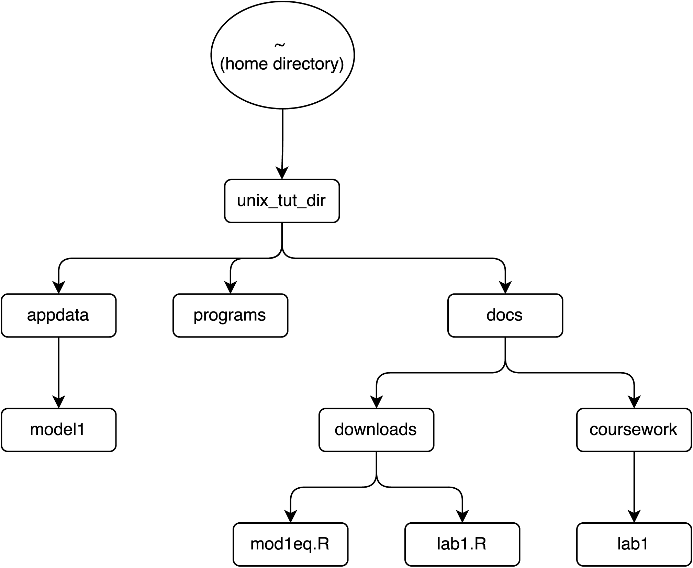
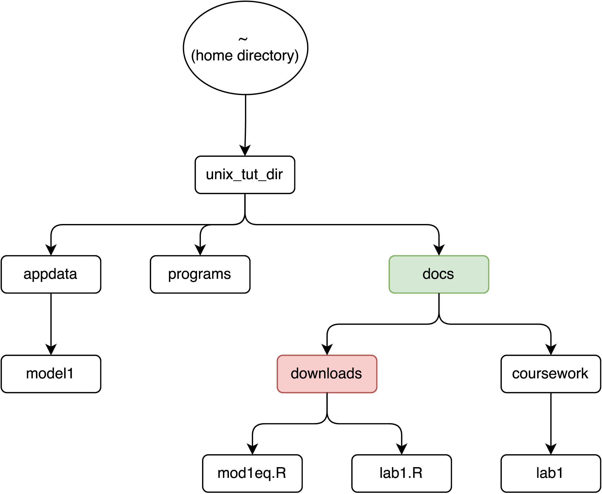
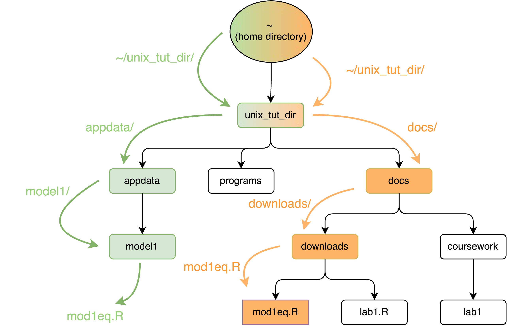
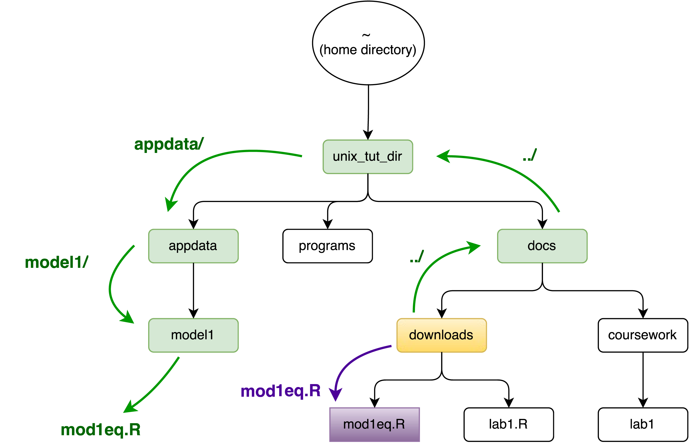

```{r setup, include=FALSE}
knitr::opts_chunk$set(echo = TRUE)
```

## Tutorial set-up
Open up terminal/cygwin and run the following code.  You don't need to understand what these commands do yet. This just sets up objects for you to work with throughout this tutorial.
```{sh, eval = F}
cd
mkdir -p unix_tut_dir/docs/coursework/lab1
mkdir unix_tut_dir/docs/downloads
mkdir unix_tut_dir/programs
mkdir -p unix_tut_dir/appdata/model1
touch unix_tut_dir/docs/downloads/mod1eq.R
touch unix_tut_dir/docs/downloads/lab1.R
cd unix_tut_dir
```

## File Organization 

You can think of your computer's organization as an upside-down tree.  In a typical file system, a leading `/` represents the `root` of your computer (where critical files are---don't store stuff here) and `~` represents your `home directory`.  For Windows users using Cygwin, you should also keep in mind that your hard drives are accessed using `/cygdrive/letter_of_drive` (e.g. the syntax for the `C` drive is `/cygdrive/c` and not `C:\\`)



The tree above shows the structure of the folder system you made at the beginning of this tutorial.

## Listing information about a directory
To see where you are currently, use `pwd`.
```
pwd
```
To list files in the present working directory, use `ls`
```
ls
```
You can use additional _flags_ to see additional information. `-a` will show hidden files. `-l` will show long-format information.
```
ls -a
ls -l
ls -a -l
ls -al   # same as ls -a -l
```
The `-l` flag is useful for viewing:

* Column 1 - File permissions
* Column 3 - Owner of the file
* Column 5 - Size of the file in bytes
* Columns 6-8 - The last time the file was modified
* Column 9 - Name of the file

## Making new folders
To make a new folder, the command is `mkdir`
```
mkdir new_folder_name
mkdir lab01 # this makes a folder called lab01 in the working directory
```
The `-p` flag makes parent directories if they don't exist yet.  The following command makes a folder called `small_russian_doll` inside a folder called `big_russian_doll`.  It creates the folder `big_russian_doll` inside the present working directory if it doesn't exist yet.
```
mkdir -p big_russian_doll/small_russian_doll
```


## Changing directories
To change directories, you use the command `cd`. The syntax is simply `cd path/to/directory`

```
cd /cygdrive/d/teaching # absolute path to teaching directory
cd     # this takes you to your home directory
cd ~   # this also takes you to your home directory
cd ..  # this takes you to the parent of the current directory
pwd    # shows you the directory you're currently in
```



__Example__ Let's suppose you are in the `downloads` folder shown in red (can you get there?).  Then to get to the `docs` folder (green), you can do one of two things
```
cd ..                  # Relative Path
cd ~/unix_tut_dir/docs # Absolute Path
```
The first line uses a _relative path_ since it relies on the fact that we are in the `downloads` folder already and the `docs` folder is one level up.

The second line uses an _absolute path_, meaning that you can use that command from any folder, and you'll always end up at `docs`

## Copying, Moving and Renaming files
To copy a file, the syntax is
```
cp file_path path_to_target_dir
cp hw1.R documents
```
To move a file, we use
```
mv old_file_path new_file_path
mv hw1.R homework_dir/hw1.R
```
Note the difference in usage! For `cp`, the second argument is the path to the __directory__ where you want to copy the file, but for `mv`, the second argument is the path to the new __file name__ that you want (e.g. `hw1.R` is repeated in the `mv` example in both the old file location and the new file location)

We can use `mv` to rename files.  This keeps the file in the same folder and changes the file name.
```
mv old_file_name new_file_name
mv hw1.R homework1.R
```
### Example of moving files:

Go to the downloads folder.  Move `mod1eq.R` to the folder `model1`.

#### __Solution with absolute paths__

The mental picture for absolute paths is shown below.  The orange arrows represent the absolute path to the file that needs to be moved.  The green arrows represent the absolute path to the target location.



```
# Solution with absolute paths
mv ~/unix_tut_dir/docs/downloads/mod1eq.R ~/unix_tut_dir/appdata/model1/mod1eq.R
```

#### __Solution with relative paths__

The mental picture for relative paths is shown below.  The purple arrow represents the relative path from the `downloads` folder to the file that needs to be moved.  The green arrows represent the relative path to the target location from the `downloads` folder.  Remember that the double dots mean "go up one level" or technically "go to the parent folder".



```
# Solution with relative paths
mv mod1eq.R ../../appdata/model1/mod1eq.R
```
#### __Mixing and Matching__
You can also mix-and-match the absolute and relative pathing.  Just be mindful of what your present working directory is when using relative paths.
```
mv mod1eq.R ~/unix_tut_dir/appdata/model1/mod1eq.R
mv ~/unix_tut_dir/docs/downloads/mod1eq.R ../../appdata/model1/mod1eq.R
```


## Removing files and folders
To remove a file, the command is `rm`
```
touch file_to_remove # creates a file called file_to_remove
rm file_to_remove
```
To remove a directory and all its contents, you need the `-r` flag
```
mkdir dir_to_remove # creates a directory to remove
rm -r dir_to_remove
```
__WARNING: When working in UNIX, there is no such thing as a "recycle bin," so file recovery is onerous, if at all possible.__

Let's go ahead and remove the tutorial directory.  You can recreate it using the code at the beginning if you still want to play around.
```
# This line takes you to your home directory
cd 
# This line deletes the tutorial folder
rm -r unix_tut_dir
```


## Basic introduction to Git
Git allows you to share files between different computers and different people, facilitating collaboration in group projects.  Moreover, it keeps track of different versions of your files so you can easily go back to earlier versions of your work or maintain multiple versions altogether.

In this class, you'll use Git to get the latest course material and to keep track of your homework and projects.

Use the code below to clone our class repository.

```
cd path_to_parent_directory # change this to where you want the folder to be
git clone https://github.com/doctordo/stat133-su2016
```

Now suppose I update the course materials, then all you have to do to update the files on your computer is change into the directory on your machine and enter `git pull`.
```
cd path_to_stat133-su2016
git pull
```

To make your own repository, the easiest way is to initialize it on GitHub and then clone it to your desired location on your machine.  After that, copy all the files you want into that folder then, in that folder, run the following four commands

```
# Go to the folder with your repository
cd path_to_folder

# This line adds everything you've changed
git add --all

# This line says you're ready to save everything.  The message in quotes should be a note to yourself about what you're uploading
git commit -m 'note about what you coded/changed'

# These two lines will update your repository on GitHub
git pull origin master
git push origin master
```
When it prompts you for your username and password, enter your GitHub account information.  Your cursor may not move as you're typing.  This is normal---just type in your credentials and hit enter.

## Workflow
As you're working on projects, an ideal workflow would be as follows:

1. Work (make changes to code inside your repository)
2. `git add --all`
3. `git commit -m 'note about new work'`
4. `git pull origin master`
5. `git push origin master`
6. Return to step 1

# Rule number one about working on the computer: 
# __SAVE OFTEN__

We are barely skimming the surface of everything Git has to offer, but I think this is a pretty good starting point for an introductory course.  Check the links below for more in-depth information.

## Additional Resources

[Berkeley SCF GitHub Tutorial by Jarrod Millman](https://github.com/berkeley-scf/tutorial-git-basics)

[Online Tutorial for UNIX command line by University of Surrey](http://www.ee.surrey.ac.uk/Teaching/Unix/)


