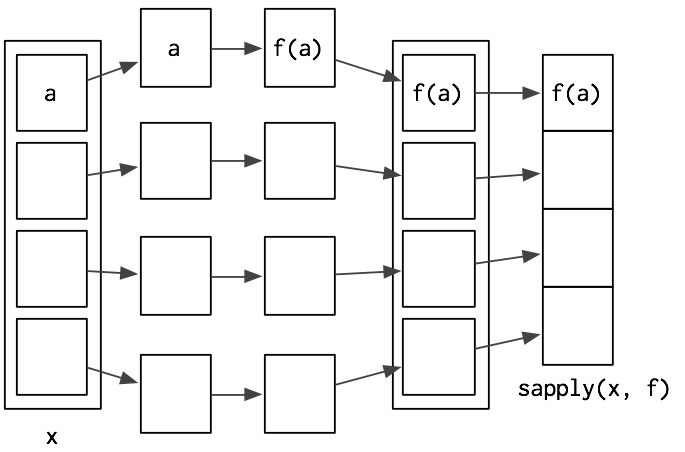
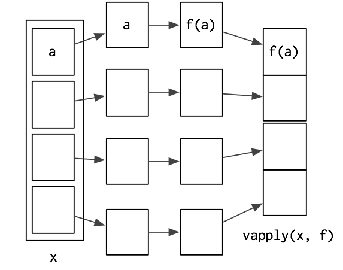

## Motivation

Imagine you've loaded a data file, like the one below, that uses $-99$ to represent missing values. You want to replace all the $-99$s with `NA`s.

```{r}
# Generate a sample dataset
set.seed(1014)
df <- data.frame(replicate(6, sample(c(1:10, -99), 6, rep = TRUE)))
names(df) <- letters[1:6]
df
```

---

## First Response

When you first started writing R code, you might have solved the problem with copy-and-paste:

```{r, eval = FALSE}
df$a[df$a == -99] <- NA
df$b[df$b == -99] <- NA
df$c[df$c == -98] <- NA
df$d[df$d == -99] <- NA
df$e[df$e == -99] <- NA
df$f[df$g == -99] <- NA
```

---

## Functions

We could write a function, removing the chance of messing up the -99:

```{r}
fix_missing <- function(x) {
  x[x == -99] <- NA
  x
}

fix_missing(df$a)
```

---

## Repeated Function Calls

This doesn't solve having to call the function on every column though:

```{r, eval = F}
df$a <- fix_missing(df$a)
df$b <- fix_missing(df$b)
df$c <- fix_missing(df$c)
df$d <- fix_missing(df$d)
df$e <- fix_missing(df$e)
df$f <- fix_missing(df$e)
```

---

## Looping

Perhaps then, we could write a loop?

```{r}

for (name in names(df)) {
  df[[name]] <- fix_missing(df[[name]])
}

```

---

## R Idiomatic Answer

```{r, echo = F}
set.seed(1014)
df <- data.frame(replicate(6, sample(c(1:10, -99), 6, rep = TRUE)))
names(df) <- letters[1:6]
```

It turns out that this approach still isn't the most "`R` way" of handling this problem.
```{r}
df[] <- lapply(df, fix_missing)
df
```

---

## Lapply

The most basic form of the apply family of functions is `lapply`.  It takes a list and returns a list.  If you give it any other object, it will run `as.list` on it first.

```
lapply(X = list_like_object, FUN, ...)
```
The `...` allows you to pass arguments to the function `FUN`.

---

## Equivalent For-loop

The `lapply` function is equivalent to the following for-loop:

```{r, eval = F}

lapply2 <- function(x, f, ...) {
  
  out <- vector("list", length(x))
  
  for (i in seq_along(x)) {
    out[[i]] <- f(x[[i]], ...)
  }
  
  return(out)
  
}
```

---

## How it works


---

## Example

Suppose we want to know how many players are in each team in this list
```{r}
players <- list(
warriors = c('curry', 'iguodala', 'thompson', 'green'),
cavaliers = c('james', 'shumpert', 'thompson'),
rockets = c('harden', 'howard')
)
lapply(players, length)
```

---

## Example 2

Or, looking a list that contains non-tabular data, we can look into the class of each element:
```{r}
nyc <-  list(pop = 8404837, boroughs =c ("Manhattan", "Bronx", "Brooklyn", "Queens", "Staten Island"), capital = FALSE)

lapply(nyc, class)
```

---

## Example 3

We can pass arguments into the function using the `...`.  Also, rebmember that data frames are internally a list of vectors!

```{r}
df <- data.frame(a = 1:3, b = 4:6, c = c(7, NA, 9))

lapply(df, mean, na.rm = TRUE)
```

---

## Anonymous functions

The `FUN` in `lapply` doesn't have to be a base `R` function.  It can be one that you've written up yourself or even a nameless (anonymous) one that you write inside the `lapply` call itself! Reserve anonymous functions for short expressions.  If it takes over a line of code, define the function outside `lapply` for readability.

```{r}
# Note that the function doesn't take on a name
lapply(1:3, function(x) x^2)
```

---

## Sapply

`sapply` is very similar to `lapply`.  The only difference is that instead of returning a list, `sapply` attempts to simplify the output down to a vector, matrix, or array if possible.

```{r}
df <- data.frame(a = 1:3, b = 4:6)
lapply(df, median)
sapply(df, median)
```

---

## Internals of Sapply

You can think of `sapply` as being `lapply` followed by `simplify2array`, which should have an evocative enough name for you to guess its function.
```{r, eval = FALSE}
sapply2 <- function(X, FUN, ...) {
  out <- lapply(X, FUN, ...)
  simplify2array(out)
}
```

---

## How it works



---

## vapply

`vapply`, like `sapply`, simplifies its results.  However, unlike `sapply`, you must tell vapply what type of vector is produced by the function.  `FUN.VALUE` is a template vector that shares the same data type and dimensions as your expected output.

```{r, eval = F}
vapply(X, FUN, FUN.VALUE = template_vector, ...)
```

---

## Example

```{r}
library(nycflights13)
vapply(flights, typeof, character(1))
```

---

## How it works



---

## tapply

`tapply` allows you to call on functions on "ragged arrays", subsetting a vector before applying the function to the subgroups.  `X` in `tapply` is a vector and not a list.

```{r, eval = F}
tapply(X, INDEX = vector_that_subsets, FUN)
```

---

## Motivation 2

You might remember the problem from homework 1 that asked you to sort the months by average departure delay.  Using our `apply` approach will reduce the problem to 1 line... not that you should condense the code this much in practice.

```{r, include = F}
library(nycflights13)
```
```{r, eval = F}
mean_delays <- with(flights, 
  c(mean(dep_delay[month == 1], na.rm = T),
    mean(dep_delay[month == 2], na.rm = T),
    mean(dep_delay[month == 3], na.rm = T),
    mean(dep_delay[month == 4], na.rm = T),
    mean(dep_delay[month == 5], na.rm = T),
    mean(dep_delay[month == 6], na.rm = T),
...TRUNCATED...
```

```{r}
order(with(flights, tapply(dep_delay, month, mean, na.rm = T)), decreasing = T)
```

---

## When?

When do you use the `lapply` family?  Almost anytime you would want to loop in R!  If your work involves iteratively creating a list, vector, dataframe, etc, then you should be using a `lapply` type of a function.  Some EXCEPTIONS:

1. Don't use `lapply` when the loop is recursive.  i.e. New elements depend on previous ones
2. You don't actually want output (e.g. you only want print statements)

---

## do.call

`do.call` is an interesting little function.  It constructs a function call using a list provided to it.  At first glance it seems that it just makes coding more wordy.  For example:

```{r}
x <- 1:5
y <- 4:9
z <- 10:12

do.call(sum, list(x, y, z))
```

---

## Example

Say you had a data frame that you wanted to add many columns to:

```{r}
x <- data.frame(first = 1:3, second = 4:6)
y <- c(7:9)
z <- c(10:12)

do.call(cbind, list(x, third = y, fourth = z))
```

Notice that I can pass named arguments!

---
