## Ceci n'est pas une pipe

These couple of slides will motivate the usage of the piping operator `%>%` from the `maggritr` package.

For a more detailed look at everything the package has to offer, consider reading through the vignette online:

[maggritr vignette](https://cran.r-project.org/web/packages/magrittr/vignettes/magrittr.html)

---

## Nested function calls

It's fairly natural that you might want to use the output of one function as the input of another.

```r
as.numeric(str_c(str_match_all(c("1 hundred", "2 tens", "3 ones"), "[0-9]+"), collapse = ""))
```

```
## [1] 123
```

To some extent, you can fix readability with whitespace

```r
as.numeric(
  str_c(
    str_match_all(c("1 hundred", "2 tens", "3 ones"), "[0-9]+"),
    collapse = ""
  )
)
```

```
## [1] 123
```

---

## Function Sandwich
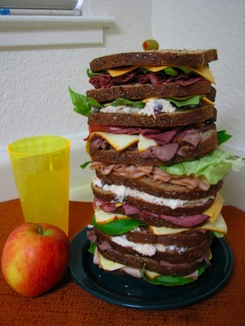

At some point, you'll just end up with a sandwich too impractical for human consumption.  The "Dagwood Sandwich" problem.

---

## Piping

Thankfully, the `maggritr` package implements a piping operator `%>%` that allows you to construct readable sequences of function calls:


```r
number <- c("1 hundred", "2 tens", "3 ones")

number %>%
  str_match_all("[0-9]+") %>%
  str_c(collapse = "") %>%
  as.numeric()
```

```
## [1] 123
```

`%>%` passes the output of the left function into the first argument of the right function.  
The keyboard shortcut for `%>%` in RStudio is `CTRL(COMMAND)+Shift+M`

---

## Data Wrangling Verbs

Verb        | Meaning
----------- | -----------------------------------------
filter      | keep rows matching criteria
select      | pick columns by name
arrange     | reorder rows
mutate      | create new variables/modify existing ones
summarise   | reduce variables to values

---

## dplyr

The structure and usage of all `dplyr` functions is as follows:

* First argument is the data frame
* Subsequent arguments say what to do with the data frame
* Function always returns a data frame
* Function never modifies in place (doesn't overwrite object)

`dplyr` comes with the `maggritr` package preloaded

---

## Some parts of this presentation will ask you to try function calls for yourself

### Load the `flights` data from the `nycflights13` package
### Install and load the `dplyr` package


```r
library(nycflights13)
library(dplyr)

flights <- tbl_df(flights)
```

---

## Examples

These next few examples will refer to the following data frame:


```r
df <- data.frame(color = c("blue", "black", "blue", "blue", "black"), value = 1:5)
df
```

```
##   color value
## 1  blue     1
## 2 black     2
## 3  blue     3
## 4  blue     4
## 5 black     5
```

---

## Filter
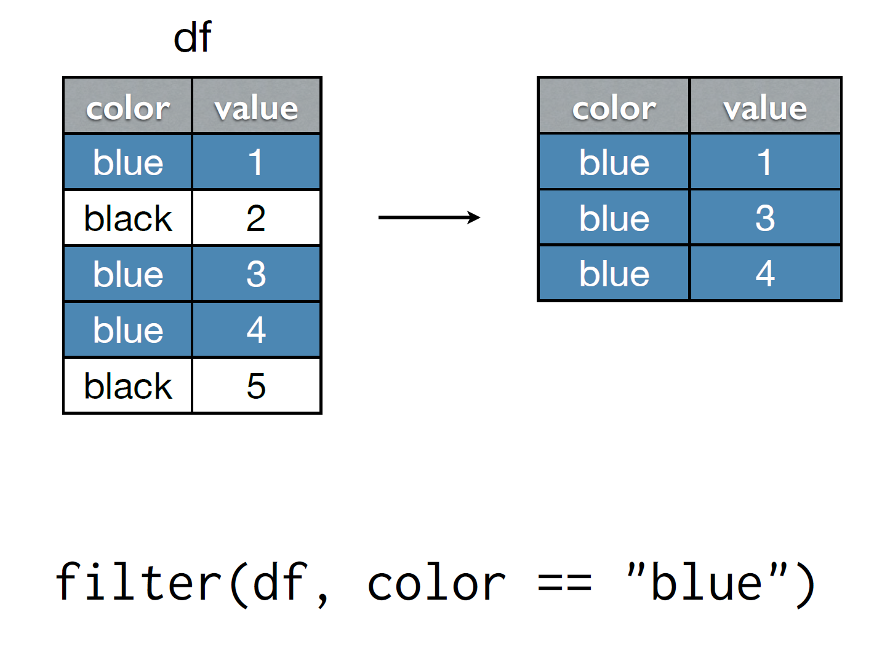

---

## Filter


---

## Find all flights

### To SFO or OAK

### Delayed by an hour

### That left between midnight and 5am

### Where the arrival delay was more than twice the departure delay

---

## Find all flights

```r
# To SFO or OAK
filter(flights, dest %in% c("SFO", "OAK"))
filter(flights, dest == "SFO" | dest == "OAK")

# Delayed by more than 1 hour
filter(flights, dep_delay > 60)

# Left between midnight and 5am
filter(flights, hour >= 0, hour <= 5)
filter(flights, hour >= 0 & hour <= 5)

# Arrival delay more than twice departure delay
filter(flights, arr_delay > 2 * dep_delay)
```

---

## Select
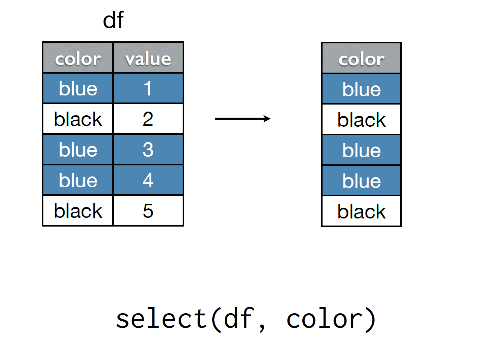

---

## Select
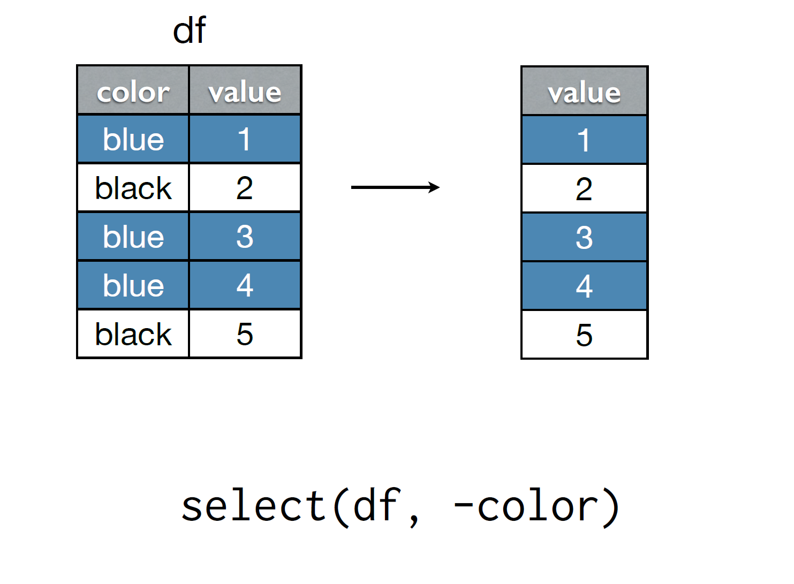

---

## Explore Select 

Try the following commands:

```r
select(flights, arrival_delay = arr_delay)
rename(flights, arrival_delay = arr_delay)
select(flights, arr_delay, dep_delay)
select(flights, arr_delay:dep_delay)
select(flights, ends_with("delay"))
select(flights, contains("delay"))
```

* `select` only keeps the variables you mention; `rename` keeps all of them
* `ends_with` and `contains` are examples of special functions that only work inside `select`
* On your own time, read through the documentation of `select` to learn about other special functions

---

## Arrange
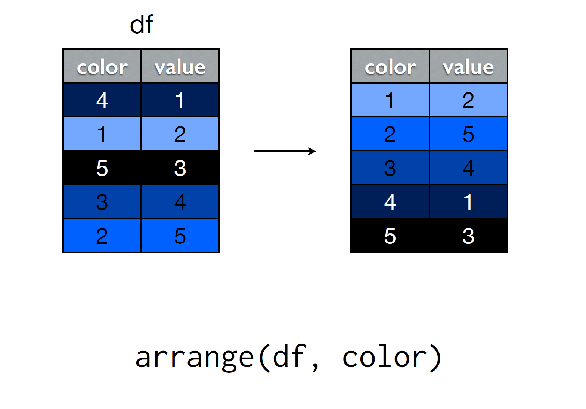

---

## Arrange
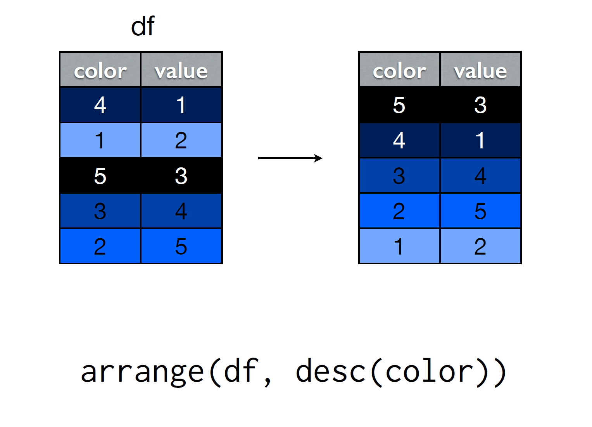

---

## Explore `arrange`

### Order the flights by departure date

### Which flights were most delayed?

### Which flights caught up the most time during the flight?

---

## Explore `arrange`


```r
# Ordered by departure date
arrange(flights, year, month, day, hour, minute)

# Most delayed means I need to know ordering
arrange(flights, desc(dep_delay))
arrange(flights, desc(arr_delay))

# Ordered by recovered/lost time during flight
arrange(flights, desc(dep_delay - arr_delay))
```

---

## Mutate
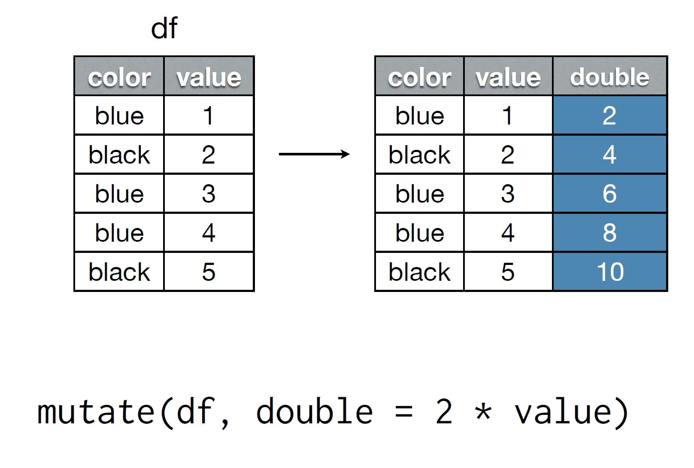

---

## Mutate
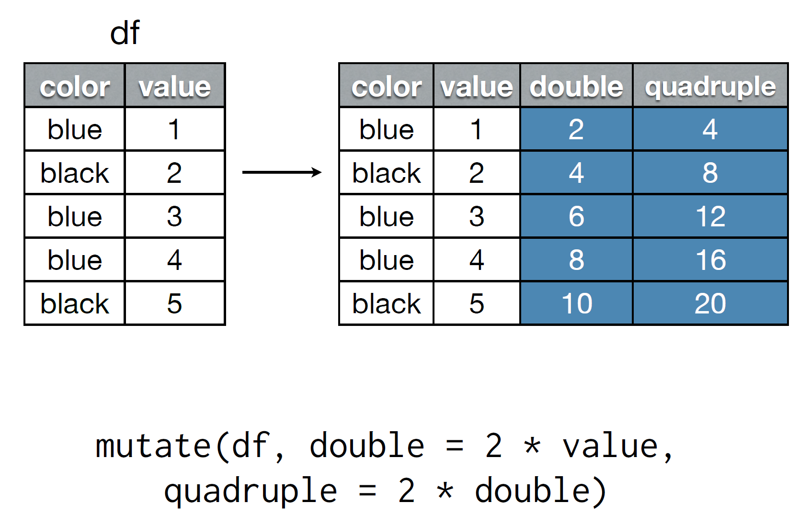

---

## Of course I can, Professor X

### Add a new variable, `recovered_delay`, that computes the difference between arrival and departure delay.

### Add a new variable, `speed`, that contains the speed in mph for each flight.  The `air_time` variable is in minutes and `distance` is in miles.  Return the top 5 fastest flights.

---

## Exploring Mutate


```r
# Recovered delay
mutate(flights, recovered_delay = dep_delay - arr_delay)

# Top 5 speediest
flights %>%
  mutate(speed = 60 * distance / air_time) %>%
  top_n(5, speed) # doesn't return the results in order

flights %>%
  mutate(speed = 60 * distance / air_time) %>%
  arrange(desc(speed)) %>%
  head(5)
```

---

## Summarise
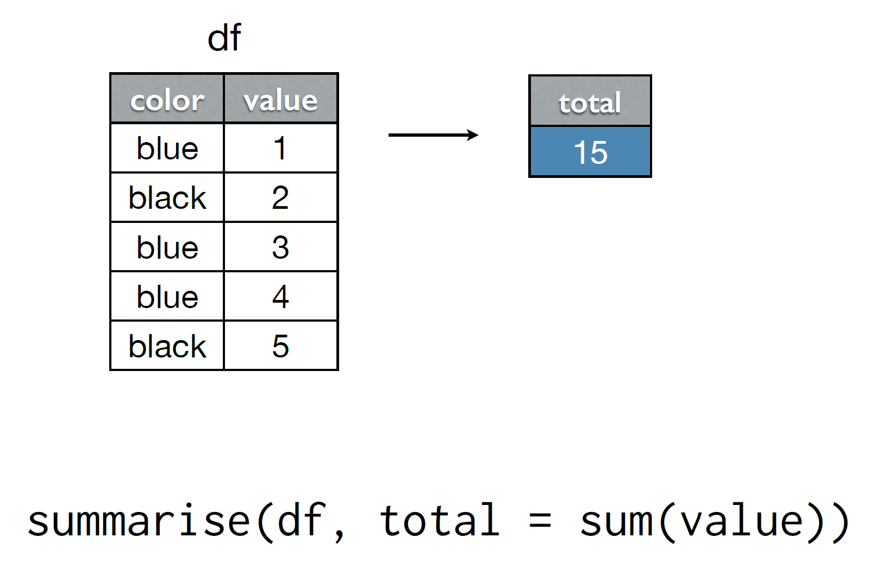

---

## Summarise
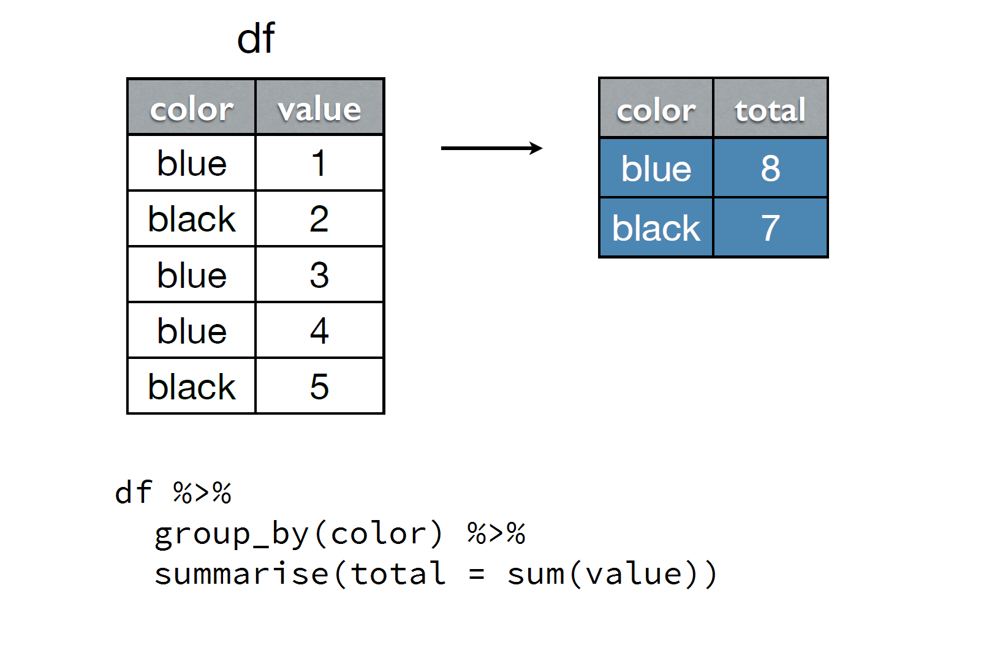

---

## Sparknotes pls

### Find the mean departure delay by date

### Find the percentage of flights each day that were over 30 minutes late for departure

---

## Multistep data wrangling

### Which destinations have the highest average arrival delays?

### I need to 
>* Group by destination -> `group_by` dest
>* Find the mean arrival delay in each group -> `summarise` with `mean`
>* Highest value means I need orderings -> `arrange` in descending order

---

## Highest average arrival delays


```r
flights %>%
  group_by(dest) %>%
  summarise(arr_delay = mean(arr_delay, na.rm = T)) %>%
  arrange(desc(arr_delay)) %>%
  top_n(7, arr_delay)
```

```
## Source: local data frame [7 x 2]
## 
##    dest arr_delay
##   (chr)     (dbl)
## 1   CAE  41.76415
## 2   TUL  33.65986
## 3   OKC  30.61905
## 4   JAC  28.09524
## 5   TYS  24.06920
## 6   MSN  20.19604
## 7   RIC  20.11125
```

---

## Two-table verbs

Now imagine we have two tables


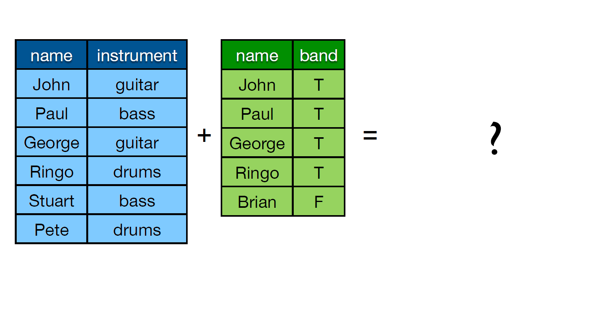

---

## Inner Join


---

## Left Join
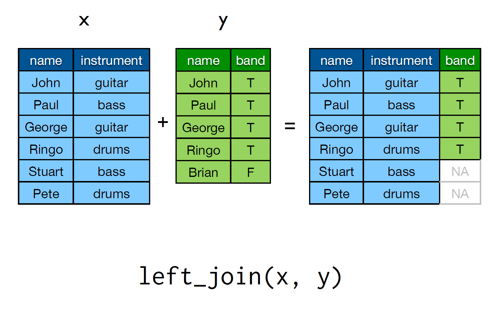

---

## Semijoin


---

## Antijoin
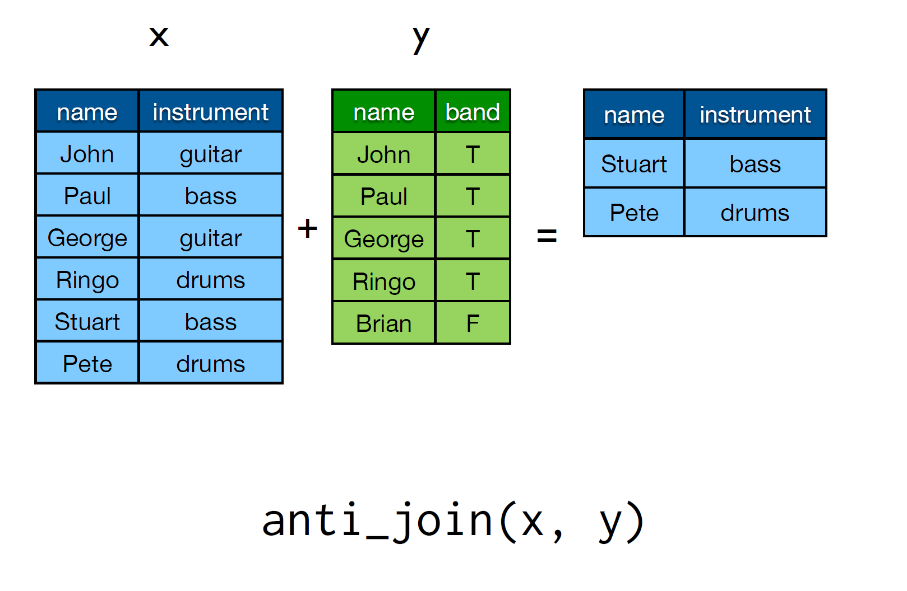

---

## Joins

Joins are always of the form
```
join(x, y, by)
```
You can specify what columns you want to use in your match by giving a character vector to `by`.  If no vector is given, the join will search for common names.  To match on variables with different names, use a named vector.  For example `by = c("a" = "b")` will match `x.a` to `y.b`

Type   | Description
------ | ------------------------
inner  | return rows in `x` AND `y`
left   | return all of `x` and matching rows in `y`
semi_join | return rows of `x` that match `y`, only columns of `x`
anti_join | only rows of `x` not in `y`, keeping only columns of `x`
full_join | return all rows and all columns from both `x` and `y`, matching when possible

---

## Slide Adaptation

These slides have been adapted from Hadley Wickham's tutorial at useR 2014.

http://www.r-bloggers.com/hadley-wickhams-dplyr-tutorial-at-user-2014-part-1/

There are two vignettes that I think would be helpful to read through:

[This dplyr vignette](https://cran.rstudio.com/web/packages/dplyr/vignettes/introduction.html)

[and this window function vignette](https://cran.r-project.org/web/packages/dplyr/vignettes/window-functions.html)

