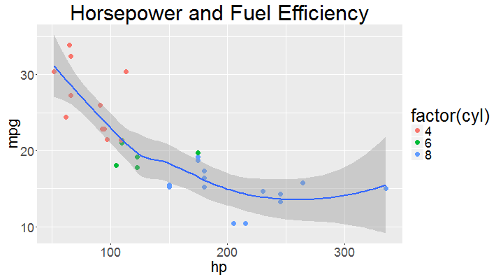
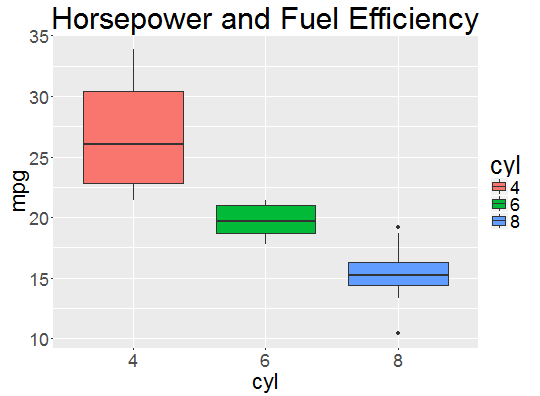

## Factors

* A factor is a vector that can contain only predefined values, and is used to store categorical data.  They handle categorical data.
* Examples Include:
  - Treatment A, Treatment B, Treatment C
  - Small, Medium, Large
  - Likert Scale (Very bad, bad, somewhat bad, neutral, ...)

---

## Internals of Factors

* Factors are NOT basic data types
* Internally, they are stored as integers


```r
my_factor <- factor(c("A", "A", "B", "A", "C"))

typeof(my_factor)
```

```
## [1] "integer"
```

```r
levels(my_factor)
```

```
## [1] "A" "B" "C"
```

---

## More Internals of Factors

Levels keep track of what the integers actually mean


```r
str(my_factor)
```

```
##  Factor w/ 3 levels "A","B","C": 1 1 2 1 3
```

```r
levels(my_factor)
```

```
## [1] "A" "B" "C"
```

---

## 3 types of categorical variables

### Binary
Two categories (e.g. Homeowner or not).  Usually handled by logical vectors

### Nomimal
No ordering to categories (e.g. Treatment A, B, C).  Handled by factors

### Ordinal
Natural ordering to categories (slow, average, fast).  Handled by ordered factors

---

## Creating Factors

Create a factor using `factor()`

```r
factor(c("red", "blue", "red", "red", "yellow"))
```

```
## [1] red    blue   red    red    yellow
## Levels: blue red yellow
```

The values a factor can take are called __levels__.  It's not necessary for all levels to be present in a factor vector.

```r
factor(c("red", "blue", "red", "red", "yellow"), 
       levels = c("red", "yellow", "blue", "green"))
```

```
## [1] red    blue   red    red    yellow
## Levels: red yellow blue green
```

---

## Ordered factors

To create an ordered factor, we just need to specify the levels in order and then pass `TRUE` to the `ordered` argument.


```r
x <- factor(c("sm", "lg", "lg", "md", "sm"), levels = c("sm", "md", "lg"), ordered = TRUE)
x 
```

```
## [1] sm lg lg md sm
## Levels: sm < md < lg
```

This allows us to sort the factors

```r
sort(x)
```

```
## [1] sm sm md lg lg
## Levels: sm < md < lg
```

---

## More Internals of Factors

To see what integers represent each level, use `unclass()`.  The order of the attributes gives the integer values.

```r
x <- factor(c("sm", "lg", "lg", "md", "sm"), levels = c("sm", "md", "lg"), ordered = TRUE)
unclass(x)
```

```
## [1] 1 3 3 2 1
## attr(,"levels")
## [1] "sm" "md" "lg"
```

To change the levels, you can assign new values a `levels()` call:

```r
levels(x) <- c("S", "M", "L")
x
```

```
## [1] S L L M S
## Levels: S < M < L
```

---

## stringsAsFactors

* By default, `data.frame` converts all strings to factors
* This will often mess things up (as we saw in lab)
* To fix this, specify `stringsAsFactors = FALSE` when making data frames and then go back and turn specific columns into factors as needed.
* By default, `readr` functions such as `read_csv` and `read_tsv` take care of this for you


```r
df <- data.frame(x = c("a", "b", "c"), y = 1:6)
str(df)
```

```
## 'data.frame':	6 obs. of  2 variables:
##  $ x: Factor w/ 3 levels "a","b","c": 1 2 3 1 2 3
##  $ y: int  1 2 3 4 5 6
```

---

## Data Set

For this next exercise, consider this data frame

```r
tbl_df(mtcars)
```

```
## Source: local data frame [32 x 11]
## 
##      mpg   cyl  disp    hp  drat    wt  qsec    vs    am  gear  carb
##    (dbl) (dbl) (dbl) (dbl) (dbl) (dbl) (dbl) (dbl) (dbl) (dbl) (dbl)
## 1   21.0     6 160.0   110  3.90 2.620 16.46     0     1     4     4
## 2   21.0     6 160.0   110  3.90 2.875 17.02     0     1     4     4
## 3   22.8     4 108.0    93  3.85 2.320 18.61     1     1     4     1
## 4   21.4     6 258.0   110  3.08 3.215 19.44     1     0     3     1
## 5   18.7     8 360.0   175  3.15 3.440 17.02     0     0     3     2
## 6   18.1     6 225.0   105  2.76 3.460 20.22     1     0     3     1
## 7   14.3     8 360.0   245  3.21 3.570 15.84     0     0     3     4
## 8   24.4     4 146.7    62  3.69 3.190 20.00     1     0     4     2
## 9   22.8     4 140.8    95  3.92 3.150 22.90     1     0     4     2
## 10  19.2     6 167.6   123  3.92 3.440 18.30     1     0     4     4
## ..   ...   ...   ...   ...   ...   ...   ...   ...   ...   ...   ...
```

---

## How would you make this graph?
Talk with the people around you.



---

## How would you make this graph?



---

## Example Code

### We will want to formalize how we talk about graphs

```r
mtcars %>%
  mutate(cyl = factor(cyl)) %>%
  ggplot(aes(x = cyl, y = mpg, fill = cyl)) +
    geom_boxplot() +
    ggtitle("Horsepower and Fuel Efficiency") +
    theme(title = element_text(size = 26),
          axis.text = element_text(size = 18),
          axis.title = element_text(size = 22),
          legend.text = element_text(size = 18))
```

---

## TOMMOROW

* Formalizing the grammar of graphics
* Basic ggplot2
* To do tonight: Install the ggplot2 package
