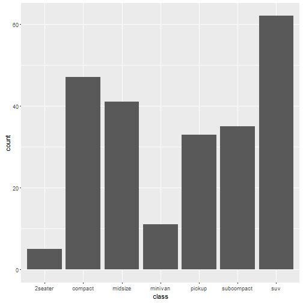
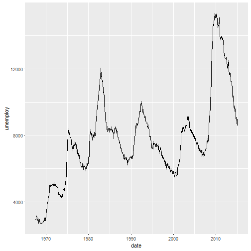
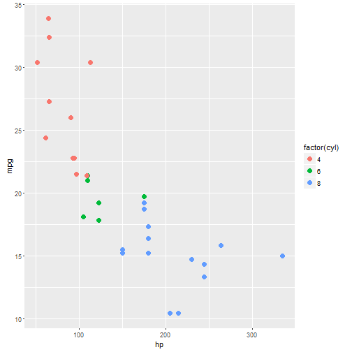
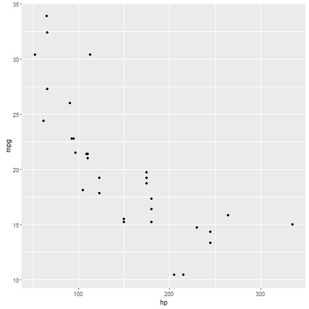
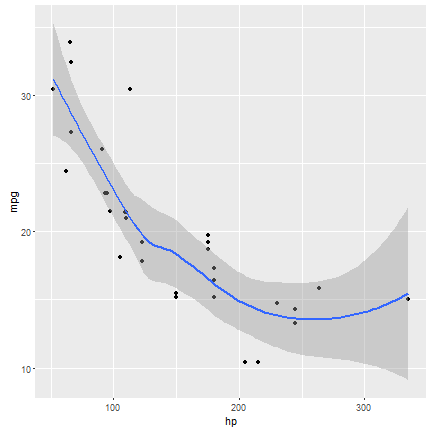
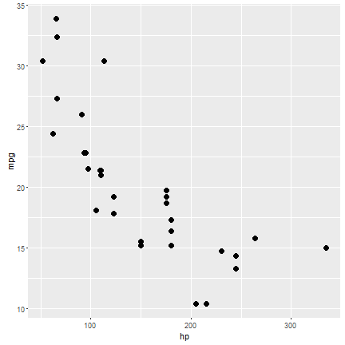
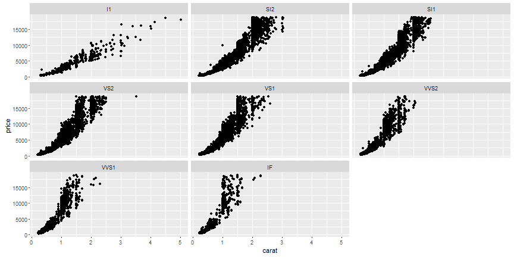
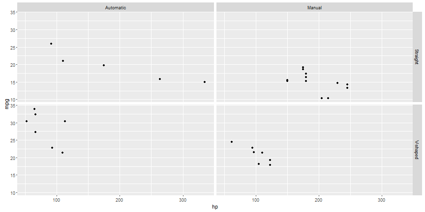

## Motivation

# "If any number of magnitudes are each the same multiple of the same number of other magnitudes, then the sum is that multiple of the sum."

# Euclid, ~300 BC

---

## Motivation

# "If any number of magnitudes are each the same multiple of the same number of other magnitudes, then the sum is that multiple of the sum."
  
# Euclid, ~300 BC

## $\sum{mx} = m \sum{x}$

> Abstraction limits vocabulary, but makes thinking about, reasoning about, and communicating easier.

---

## What is a plot?

* A plot is a set of __layers__
* A set of scales
* A coordinate system
* A facetting specification

---

## What is a layer?

Layers consist of:
* Data
* Aesthetic mappings `aes`
* A geometric object `geom`
* A statistical transformation `stat`
* A position adjustment `position`

---

## Geometries and Aesthetics
Geometries are the shapes and lines representing data in a plot.  Aesthetics are physical qualities of the geometries in the graph.  The most common aesthetics are:

Aesthetic      | Description
-------------- | -------------------------------------------------------------
x              | position along the x-axis
y              | position along the y-axis
color          | color of 1D component (point, line)
fill           | color of 2D component ("insides")
alpha          | opacity (opposite of transparency).  takes on values from 0-1
shape          | shape used for points

* [Click on this link for more information about aesthetics](http://docs.ggplot2.org/current/vignettes/ggplot2-specs.html)
* [Click on this link for a comprehensive list of available geometries](http://docs.ggplot2.org/current/)

---

## Common geometries - Bar


```r
ggplot(mpg, aes(class)) + geom_bar()
```



---

## Common geometries - Points

```r
ggplot(mtcars, aes(wt, mpg)) + geom_point()
```


---

## Common Geometries - Line

```r
ggplot(economics, aes(date, unemploy)) + geom_line()
```



---

## What geometry is in this plot and what are its aesthetics?



--- &dubcol

## First principles

*** =left

```r
ggplot() +
  layer(
    data = mtcars,
    mapping = aes(x = hp, y = mpg),
    geom = "point",
    stat = "identity",
    position = "identity"
  )
```

*** =right


--- &dubcol

## Wordy

The last way of writing it was somewhat wordy.  Instead, we can rely on default geometries and statistics.  Every `geom` has an associated default statistic (and vice versa):

*** =left

```r
ggplot() +
  geom_point(mtcars,aes(hp, mpg))
```

*** =right 


---

## Default Geometries for Statistics:

Graph Type   | call               | statistic | default geom
------------ | ------------------ | --------- | --------------
histogram    | geom_histogram     | bin       | bar
smoother     | geom_smooth        | smooth    | line
boxplot      | geom_boxplot       | boxplot   | boxplox
density      | geom_density       | density   | line
freqpoly     | geom_freqpoly      | bin       | line

--- &dubcol

## Multiple layers

You can add on multiple layers with `+`.  If you don't specify aesthetics, then the layer inherits those values in order from the main ggplot call.

*** =left

```r
ggplot(mtcars, aes(hp, mpg)) +
  geom_point() +
  geom_smooth()
```

*** =right


--- &dubcol

## Fixed Aesthetics 

We usually think of aesthetics as being __mapped from variables__.  However, when customizing our graphics, it's often desirable to specify fixed aesthetics.  Below, `x` and `y` are being mapped from variables whereas `size` is a __fixed aesthetic__.  Note that it sits outside the `aes` call.

*** =left


```r
ggplot(mtcars) +
  geom_point(aes(hp, mpg), size = 3)
```

*** =right


---

## Faceting

Facets refer to different sides of an object.  When graphing, facetting refers to splitting your data up into subsets and then making multiple graphs from those data.  There are two faceting calls:

* `facet_wrap(~x)` __facets__ the `x` variable, __wrapping__ the panels to make sure they all fit in the frame
* `facet_grid(x~y)` __facets__ the `x` and `y` variable, __gridding__ them so that the `x` values form the rows and `y` values form the columns
* Obviously facetting only works with categorical (factor) variables

---

## Examples of facet_wrap


```r
ggplot(diamonds) + geom_point(aes(carat, price)) + facet_wrap(~clarity)
```



---

## Example of facet_grid


```r
ggplot(cars, aes(hp, mpg)) + geom_point() + facet_grid(vs~am)
```



---

## Learning ggplot2

### ggplot2 mailing list
http://groups.google.com/group/ggplot2

### stackoverflow
http://stackoverflow.com/tags/ggplot2

### Cookbook for common graphics
http://wiki.stdout.org/rcookbook/Graphs/

### ggplot2 book
http://www.springerlink.com/content/978-0-387-98140-6/contents/
