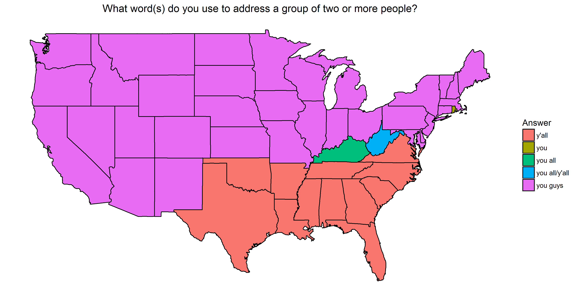

```{r setup, include=FALSE}
knitr::opts_chunk$set(echo = TRUE)
# libraries go here
```

## Introduction

In a superficial way, this assignment is meant to make sure you're familiar with plotting spatial data.  However, the bulk of your time will most likely be devoted to wrangling and reshaping the data so that it's ready to be graphed.  As we move into the final stretch of the class, the hints will now become more sparse.  As with all the previous homeworks, there's no need to look up fancy packages or techniques.  Everything can be done with the tools we already have unless stated otherwise.

## The Data
The data are in the form that they were originally collected (except someone was nice enough to gather all the lat/long coordinates of the zip codes for you).

The data come from a Dialect Survey conducted by Bert Vaux.  Some limited information can be found at the original depracated website [http://www4.uwm.edu/FLL/linguistics/dialect/index.html](http://www4.uwm.edu/FLL/linguistics/dialect/index.html).  Although 122 questions were asked in the survey, the subset of the data provided to you only contains answers to the 67 questions that focused on lexical rather than phonetic differences.

There are three files included in this assignment:

* `question_data.Rdata`, an Rdata file containing
    + `quest.mat` a data frame containing the questions
    + `all.ans`, a list of data frames containing answers to the questions
* `lingData.txt`, a space-separated data table where each observation represents a response to the survey
    + `ID` a unique ID for each participant
    + `CITY` self-reported city of the participant
    + `STATE` self-reported state of the participant
    + `ZIP` self-reported zip code of the participant
    + `lat/long` coordinates calculated from the center of each zip code
    + `Q50-Q121` the participant's response to a question.  Some questions are missing in this range.  A value of 0 indicates no response.  Other numbers directly match their corresponding letter e.g. `1` should match with `a`.
* `lingLocation.txt` an aggregated data set.  The responses from `lingData.txt` were turned into binary responses (e.g. "1 if Participant answered a on question 50 and 0 otherwise").  The data were then binned into 1 degree latitude by 1 degree longitude "squares".  Within each of these bins, the binary response were summed over individuals.
    + `Cell` a unique ID for each lat/long bin
    + `Latitude/Longitude` coordinates for the cell
    + `V4-V471` the number of responses for the corresponding question and answer in the cell.  `V4` corresponds to response `a` to question `50` while `V468` corresponds to answer `g` for question `121` (the very last answer to the last question)
    
Note that while the rows represent the same _data_ in `lingData.txt` and `lingLocation.txt`, they are different _observational units_.  For example, say John and Paul take this questionnaire for two questions. The first question has three answer choices and the second question has four answer choices. If John answered A and D and Paul answered B and D, then `lingData` would encode two vectors: `(1, 4)` and `(2, 4)`. If they lived in the same longitude and latitude box, then it would be encoded in `lingLocation` as one vector: `(1, 1, 0, 0, 0, 0, 2)`.
    
You'll need `read_delim` from the `readr` package to read in the last two files.  Remember to specify the `delim` argument, which demarcates how fields are separated in the text file.

## Task 0
Explore and clean the data.  Document what was added/removed, explaining your actions.
```{r}
# Your cleaning code.
```
__A paragraph explaining your cleaning process__

## Task 1

Implement a Shiny App that colors a map of the continental US based off the most common answer for each state. The user should be allowed to pick one of the 67 questions from a dropdown menu.  If a state has two or more answers that tied, the map should show the tie as a different color.  A static example with a tie in West Virginia is shown below:



As with homework 6, include your server and ui code below along with a link to your app on shinyapps.io.
```{r}
# ui code
```

```{r}
# server code
```
[Change the url to the link to your app](www.yourlinkgoeshere.com)

## Task 2

Make visualization(s) of the `lingLocation` data for two questions that you found interesting.  Remember that each row represents a 1x1 square centered at the given lat/long coordinate.

```{r}
# plot code goes here
```

